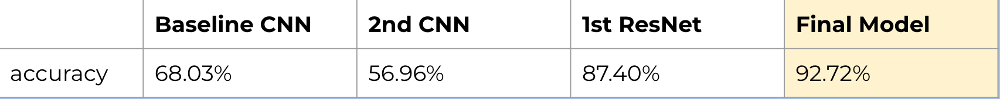
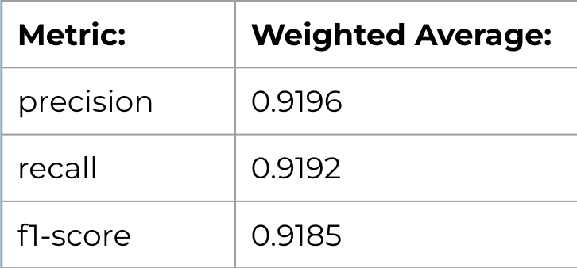

# Weather Image Classification
### Stats 362 - Fall 2025
Team Members: Isabella Toth, Sana Nanlawala, Nicole Marcatoma 

## Introduction
Manual identification of weather from images is slow, inconsistent, and difficult to scale, especially for real-time use. Automation could improve environmental monitoring, transportation safety, agriculture, and disaster response, where timely weather recognition matters. This project focuses on building a deep learning model to classify weather conditions from images. Our goal is to accurately recognize different weather types by training a CNN-based model on a labeled image dataset. Throughout the process, we performed data preprocessing, exploratory analysis, and iterated through multiple model attempts to improve performance and generalization.

## Dataset 
We use the Weather Dataset from Kaggle, which contains a large collection of labeled weather images spanning multiple conditions. This dataset provides enough variation to train, validate, and evaluate our model effectively, making it well-suited for image-based weather classification tasks.

Link to dataset: [Weather Dataset (Kaggle)](https://www.kaggle.com/datasets/jehanbhathena/weather-dataset)

## Directory 
### Baseline Models 
- `preliminary_model.ipynb` - A simple baseline CNN trained on smaller images to establish an initial performance benchmark.
- `baseline_model.ipynb` - Improved baseline model with cleaner training structure, extended training, and slight tuning to better stabilize learning. Used to further enhance intermediate, final models. 
  
### Interim Report
- `final_interim_report.html` - A milestone progress report covering data exploration, modeling attempts, results, and next steps.

### Model Iterations
- `model_attempt2.ipynb` - Second attempt where performance was improved by increasing image size to 128×128, adding data augmentation, BatchNorm, Dropout, learning-rate scheduling, and early stopping. 
- `model_attempt3.ipynb` - Third attempt scaling images to 224×224 (ResNet input size), reducing augmentation, introducing class-weighted loss to address imbalance, and continuing early stopping.

### Final Model 
- `final_model.ipynb` - Final model using ResNet50 with improved training strategy and class balancing.

### Figures 
- `figures` - Folder containing our plots from our presentation. 

## Key Results
Our model performance improved over multiple iterations as shown in the tables. The baseline CNN reached 68.03% accuracy, while our second CNN configuration underperformed at 56.96%. Switching to a ResNet-based approach significantly boosted results to 87.40%, and further tuning with data balancing and optimization produced our final model accuracy of 92.72%.




The accompanying metrics image also shows strong final model performance across precision (0.9196), recall (0.9192), and F1-score (0.9185), indicating reliable predictions with balanced sensitivity and precision across classes.




## Notes on Reproducability & Obtaining Data 
- Use of Python Version 3.12.12 is suggested
- GPU is preferred over CPU to run models more efficiently
- `pyproject.toml` has dependencies and python requirements listed
- Dataset can be accessed here, as it is too large over Github [Weather Dataset (Kaggle)](https://www.kaggle.com/datasets/jehanbhathena/weather-dataset)

  To obtain data for reproducability:
  1. Use link provided above to download data
  2. Upload data file to Google Drive
  3. Run the following code to connect data to notebook file

 ```python
from google.colab import drive
drive.mount('/content/drive')
!unzip -q /content/drive/MyDrive/dataset.zip -d /content/dataset
path = '/content/dataset/dataset'
```

Link to presentation: [Weather Classification](https://docs.google.com/presentation/d/15wyyW8vrFRf-gUxqAQqmWRKfeO6eIrk3__d2vayoMX4/edit?usp=sharing) 
